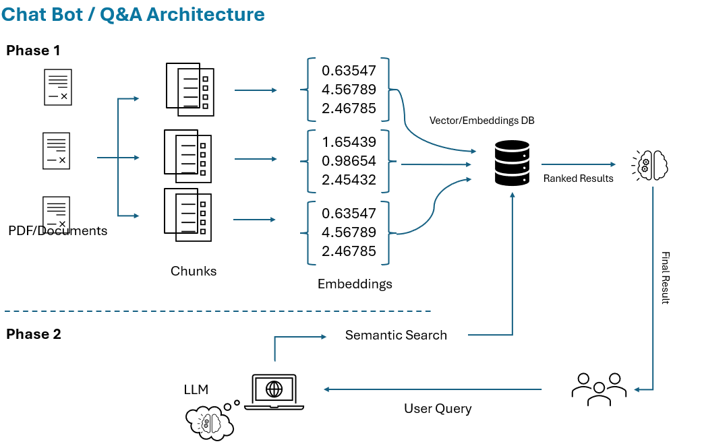

# Chat_Bot
### This repo will be guide the developers to create a chat bot using LLM's.
### Code Repo can also be utilized for replicating the Q&A Tool.

## Key Pointers
### Prompt Engineering - Process of crafting well defined and structured input queries to interact with AI systems to obtain relevant information from LLM's.

### Embeddings - Numerical Representation of Text. Embeddings of are generated by chunking the given text such that context information is also stored along with the actual meaning. Hence, embeddings play an important role in generating textual information.

### Fine Tuning - It is the process of making the pretrained LLM to adapt to a specific domain such that it can perform tasks to cater that domain more effectively.

    - Self Supervised - Passing a domain specific training data to a LLM.
    - Supervised - Detailed Data and its Labels are passed to a LLM.
    - Reinforcement - Providing a reward when it performs the desired operation. 

### LLM Model :
    - Currently, I've utilized the Mistral AI Model for the Development.

### Developed Architecture:

